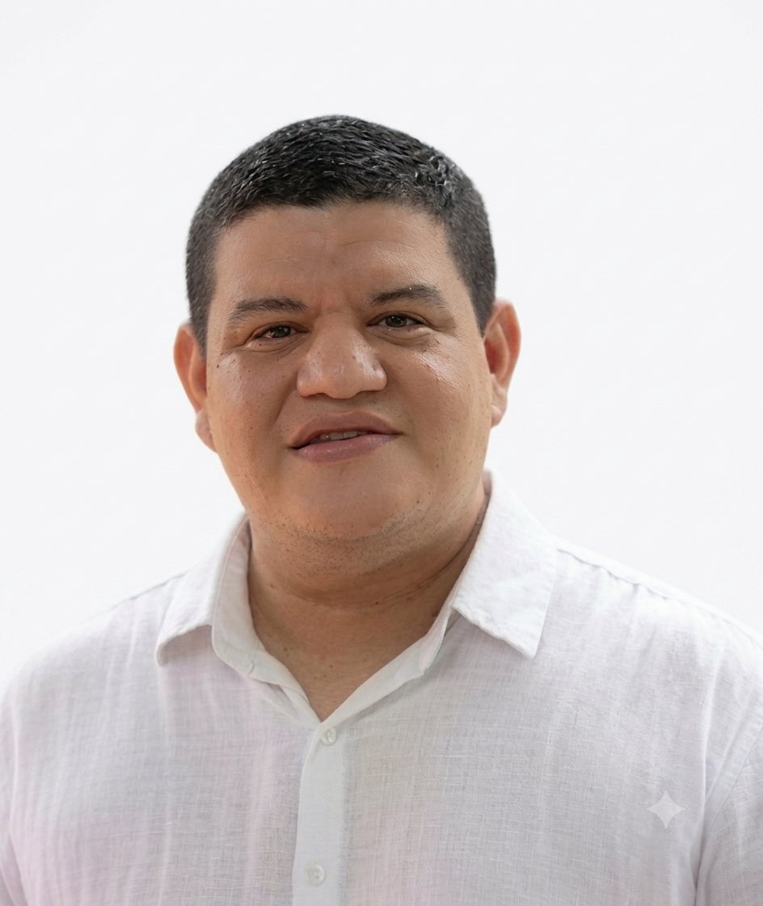
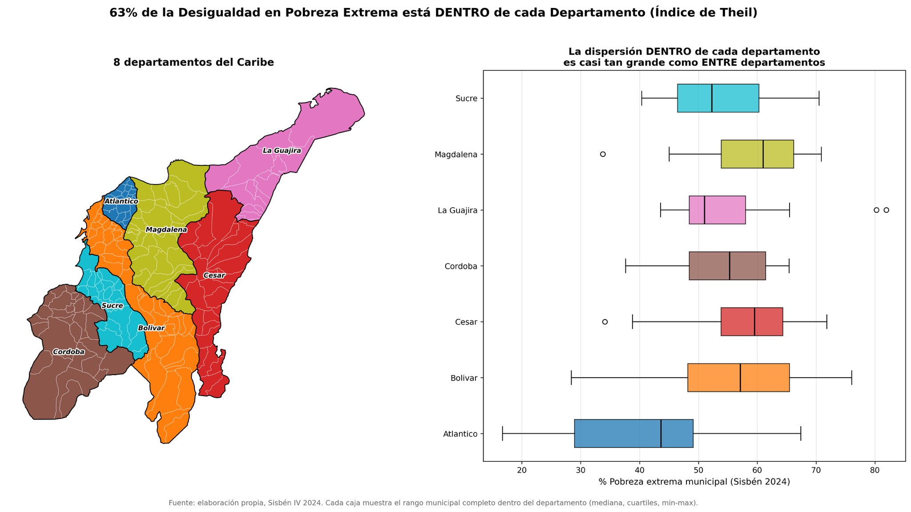
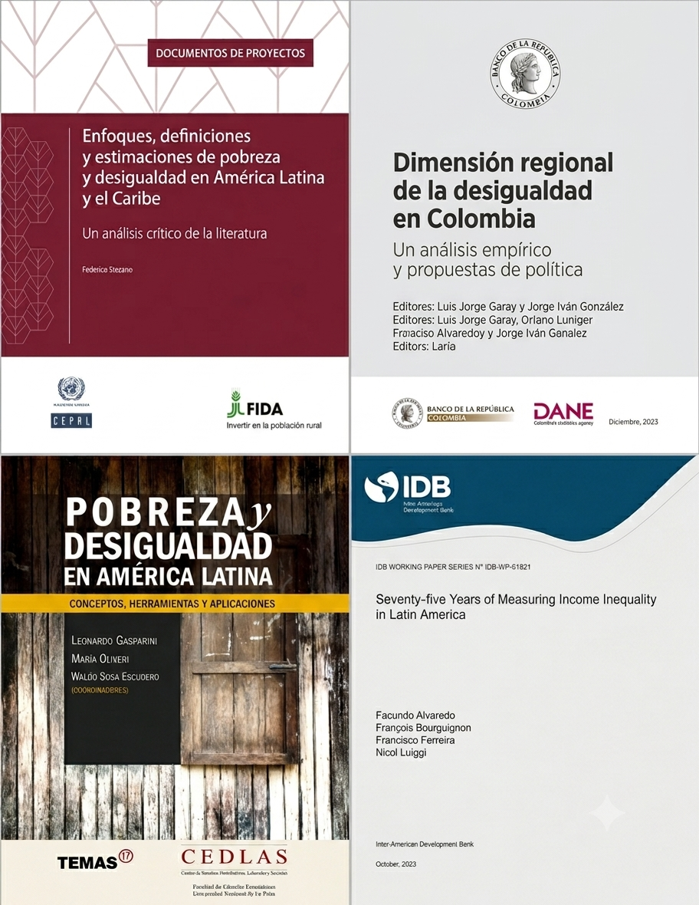
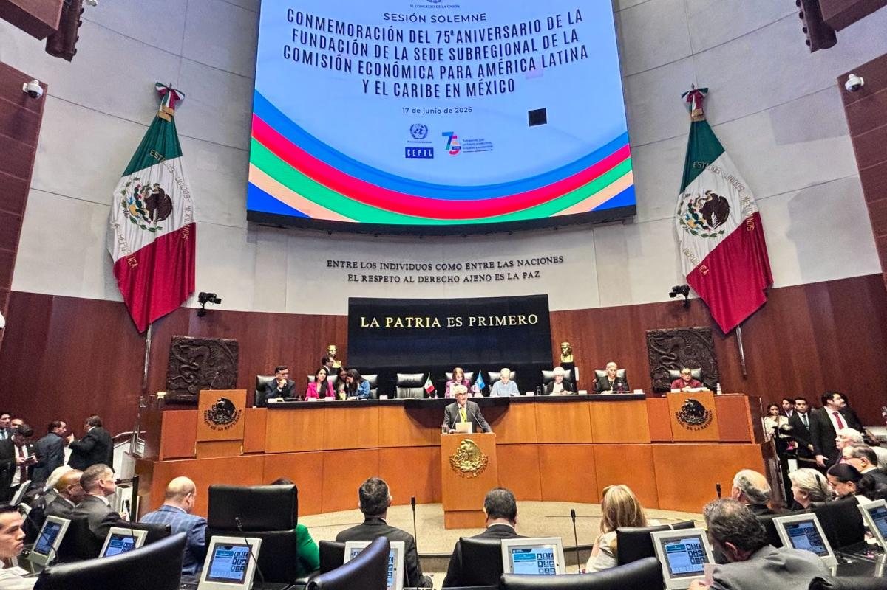

## Presentación {.cv-slide}

:::: {.columns}

::: {.column width="26%"}
{.cv-photo}

::: {.cv-name}
Carlos Andrés Yanes Guerra
:::

::: {.cv-role}
Director del OCSA
:::
:::

::: {.column width="74%"}
::: {.cv-row}
🎓 Profesor Asistente, Departamento de Economía
:::

::: {.cv-row}
📉 Enfocado en Microeconomía, Econometría y Ciencia de Datos
:::

::: {.cv-row}
👤 [Carlos Andrés Yanes Guerra](https://www.linkedin.com/in/carlos-andres-yanes-guerra-0026bb31/?originalSubdomain=co)
:::

::: {.cv-row}
𝕏 [@Keynes37](https://x.com/keynes37)
:::

::: {.cv-row}
✉️ [cayanes@uninorte.edu.co](mailto:cayanes@uninorte.edu.co)
:::

::: {.cv-row}
💻 [GitHub](https://github.com/keynes37)
:::

::: {.cv-row}
🎓 [Google Scholar](https://scholar.google.com/citations?user=NlFSQDwAAAAJ&hl=es)
:::
:::

::::

## Contenido

::: {style="font-size: 1.2em; line-height: 1.9;"}
- La desigualdad como problema regional.
- América Latina y Colombia en cifras: niveles y tendencias.
- ¿Qué explica la desigualdad en la región?
- Políticas públicas para reducir la desigualdad.
- Conclusiones y reflexiones finales.
:::

# La desigualdad de ingresos  como problema regional {.section-slide data-section-number="01"}

## La alta desigualdad en la región

::: {style="font-size: 1.15em; line-height: 1.5;"}
América Latina enfrenta una desigualdad estructural que limita el crecimiento, debilita la cohesión social y afecta las instituciones. Superarla requiere no solo crecimiento económico, sino políticas públicas orientadas a un desarrollo más inclusivo.
:::

::: {.source}
Fuente: CEPAL, Panorama Social de América Latina y el Caribe 2025.
:::

## Desigualdad estructural: datos clave {.incremental}
::: {style="font-size: 0.8em; line-height: 1.4; display: grid; grid-template-columns: 1fr 1fr; gap: 1em; height: 470px;"}
::: {.kpi-box}
**🌎 Desigualdad de ingresos**
0,40-0,70
rango del Gini en la región
:::
::: {.kpi-box}
**📊 Lo que las encuestas no ven**
+17pp
sube el Gini al sumar ingresos de capital y de los más ricos
:::
::: {.kpi-box}
**🗺️ Desigualdad entre países**
~8%
de la desigualdad regional; el resto es dentro de cada país
:::
::: {.kpi-box}
**🎓 Desigualdad de oportunidades**

- Bloquea la movilidad social
- El capital humano es el factor más determinante
:::
:::

::: {style="margin-top: 0.6em;"}
::: {.source}
Fuente: Alvaredo, Bourguignon, Ferreira y Lustig (2023), *Seventy-five Years of Measuring Income Inequality in Latin America*, BID — 1948-2021 (75 años), 34 países de América Latina y el Caribe.
:::
:::

# América Latina y Colombia  en cifras: niveles y tendencias {.section-slide data-section-number="02"}

## Coeficiente de Gini en el mundo

<iframe src="https://archive.ourworldindata.org/20260703-175051/grapher/economic-inequality-gini-index.html?tab=table&time=1990..latest" loading="lazy" style="width: 100%; height: 500px; border: 0px none;" allow="web-share; clipboard-write"></iframe>

## Tendencia reciente: Coeficiente de Gini en América Latina

:::: {.columns}

::: {.column width="33%"}

- *Colombia* es uno de los países más desiguales del mundo.

- *América Latina* ha reducido gradualmente la desigualdad desde inicios de los 2000s, aunque mantiene niveles elevados.
Colombia permanece rezagada mientras se aleja de la tendencia regional, con niveles de desigualdad prácticamente idénticos a los de hace 30 años.

:::

::: {.column width="67%"}
<iframe src="charts/gini_interactive.html" style="width: 100%; height: 480px; border: 0px none;"></iframe>

::: {.source}
Fuente: CEPALSTAT, elaboración propia.
:::
:::

::::

## Una mirada más de cerca

:::: {.columns}

::: {.column width="33%"}
::: {style="font-size: 0.8em; line-height: 1.3;"}
**Ranking mundial**

- Colombia: #1 (más desigual)
- Brasil: #2
- Chile: #8
- Ecuador/Paraguay: #6-9
- Argentina: #10
- Uruguay/Perú: #12-15 (menos desiguales)

::: {style="font-size: 0.75em; color: #857a70; margin-top: 0.5em;"}
*Nota: 2021 incluye 80+ países; 2024 tiene ~30 países.*
:::
:::
:::

::: {.column width="67%"}
<iframe src="charts/gini_desglose.html" style="width: 100%; height: 480px; border: 0px none;"></iframe>

::: {.source}
Fuente: CEPALSTAT, elaboración propia.
:::
:::

::::

## Índice de Theil: Un reflejo de lo mismo

:::: {.columns}

::: {.column width="35%"}
::: {style="font-size: 0.85em; line-height: 1.4;"}
**Indicador complementario**

El Índice de Theil mide la desigualdad de forma alternativa al Gini, otorgando más peso a las colas de las distribuciones.

- Colombia nuevamente muestra ser el más desigual de América Latina, pero con una brecha más amplia frente a otros países según este indicador.
:::
:::

::: {.column width="65%"}
::: {style="width: 100%; height: 520px; overflow-x: auto; overflow-y: hidden;"}

<iframe src="charts/theil_index.html" style="width: 100%; height: 100%; border: 0px none;"></iframe>

:::

::: {.source}
Fuente: CEPALSTAT, elaboración propia.
:::
:::

::::

## Índice de Theil: un análisis de las disparidades  territoriales en Colombia

:::: {.columns}

::: {.column width="62%"}
{width=100%}
:::

::: {.column width="38%"}
::: {style="font-size: 0.72em; line-height: 1.4;"}
- **Compartir departamento no implica compartir condiciones**: municipios como Valledupar y Pueblo Bello (Cesar) presentan una brecha de 44 puntos porcentuales en pobreza extrema.
- **Las políticas departamentales pueden pasar por alto a los más rezagados**: diseñar intervenciones con base en promedios departamentales puede invisibilizar las necesidades de los municipios con mayores privaciones.
:::

::: {.source}
Fuente: [Alvaro Chaves](https://x.com/achavito), Working Paper, 2026.
:::
:::

::::

## Participación en los ingresos nacionales

:::: {.columns}

::: {.column width="50%"}
::: {style="font-size: 0.9em; line-height: 1.8;"}
**1% de mayores ingresos**

<a href="https://wid.world/share/#1/countriesmap/sptinc_p99p100_z/all/last/eu/k/p/yearly/s/false/18.271/35/curve/false/region" target="_blank">Explorar →</a>

**10% de mayores ingresos**

<a href="https://wid.world/share/#1/countriesmap/sptinc_p90p100_z/all/last/eu/k/p/yearly/s/false/18.271/35/curve/false/region" target="_blank">Explorar →</a>

**50% de menores ingresos**

<a href="https://wid.world/share/#1/countriesmap/sptinc_p0p50_z/all/last/eu/k/p/yearly/s/false/18.271/35/curve/false/region" target="_blank">Explorar →</a>
:::
:::

::: {.column width="50%"}
::: {style="font-size: 0.95em; line-height: 1.6;"}

- En América Latina, el 1 % de la población con mayores ingresos concentra, en promedio, **una cuarta parte** del ingreso total de la región.

- En Colombia, el 10% de la población con mayores ingresos concentra **más de la mitad** del ingreso nacional.

- Mientras tanto, la mitad de la población con menores ingresos percibe **menos del 10%** del ingreso nacional.

- En términos generales, Colombia no difiere mucho del promedio latinoamericano en este aspecto, aunque presenta niveles de desigualdad ligeramente superiores a los de la mayoría de los países de la región.

:::
:::

::::

## Lo más reciente: cifras de 2024 {.incremental}
::: {style="font-size: 0.78em; line-height: 1.35; display: grid; grid-template-columns: 1fr 1fr; gap: 1em; height: 470px;"}
::: {.kpi-box}
**🇨🇴 Gini Colombia 2024**
0,551
vs. 0,553 en 2023 — mejora marginal, sigue entre los más altos del mundo
:::
::: {.kpi-box}
**📉 Pobreza monetaria Colombia**
31,8%
-2,8pp frente a 2023; la mayor caída desde 2012 (DANE)
:::
::: {.kpi-box}
**🌎 Gini regional 2024**
0,452
vs. 0,456 en 2023; pobreza regional baja de 27,7% a 25,5% (CEPAL)
:::
::: {.kpi-box}
**🧩 Palanca pendiente**
-14%
caería el Gini regional con formalización laboral plena (CEPAL)
:::
:::

::: {style="margin-top: 0.6em;"}
::: {.source}
Fuente: DANE, Boletín Técnico Pobreza Monetaria 2024; CEPAL, Panorama Social de América Latina y el Caribe 2025.
:::
:::

# ¿Qué explica la desigualdad  en la región? {.section-slide data-section-number="03"}

## El comportamiento de la desigualdad  en A. Latina: Síntesis de la literatura

:::: {.columns}

::: {.column width="65%"}
::: {style="font-size: 0.68em; line-height: 1.3;"}
- Es más desigual de lo que le tocaría por su nivel de desarrollo. (Gasparini et al., 2013)
- La concentración está arriba, justo donde las encuestas no ven bien. (Alvaredo et al., 2023)
- Subió con los ajustes y reformas de mercado de los 80-90; bajó en los 2000 por más transferencias y salario mínimo. (Alvaredo et al., 2023)
- Cae el premio a la educación cuando la oferta de gente calificada crece más rápido que la demanda tecnológica por ella — y sube cuando pasa al revés. (Bonilla Mejía, 2011)
- Raíces coloniales (tierra e instituciones extractivas), aunque su peso exacto hoy se discute. (Stezano, 2020)
- Perdió ventaja comercial frente a Asia y la antigua URSS, y no acumuló capital humano ni físico a tiempo. (Stezano, 2020)
- Las élites capturan las instituciones y bloquean la redistribución — y esa misma desigualdad les da más poder para sostenerlo. (Stezano, 2020)
:::
:::

::: {.column width="35%"}

{width=320px}

:::

::::

# Políticas públicas para reducir  la desigualdad en Colombia y la región  {.section-slide data-section-number="04"}

## Políticas públicas frente a la  desigualdad   en América Latina

:::: {.columns}

::: {.column width="67%"}
::: {style="font-size: 0.8em; line-height: 1.4;"}
- **Transferencias condicionadas** (Oportunidades/México, Bono de Desarrollo Humano/Ecuador, AUH/Argentina): bien focalizadas, bajan la pobreza de forma medible.
- **Salario mínimo** como piso igualador del ingreso.
- **Reforma tributaria progresiva**: la carga subió de 14% a 21% del PIB (1990-2013), pero sigue regresiva y lejos de la OCDE (34%).
- **Más inversión y equidad en educación** y formación de competencias.
- **Enfoque CEPAL**: política social universal + focalizada, con enfoque de derechos.
:::
:::

::: {.column width="33%"}
{width=100%}

::: {.source}
CEPAL, Sesión Solemne 75° Aniversario, Ciudad de México, 17 de junio de 2026.
:::
:::

::::

## Colombia: Políticas y retos

:::: {.columns}

::: {.column width="50%"}
::: {style="font-size: 0.7em; line-height: 1.45;"}
- **Más Familias en Acción (MFA)**: el principal programa de transferencias condicionadas (PTC) del país, enfocado en salud y educación para familias vulnerables.
- **Red Unidos**: no es propiamente un PTC, sino una estrategia de acompañamiento y coordinación interinstitucional para que las familias superen la pobreza extrema.
- **Colombia Mayor**: programa que otorga subsidios económicos a adultos mayores desamparados, sin pensión o en indigencia.
- **Jóvenes en Acción**: enfocado en la formación y el fortalecimiento de habilidades para la población joven.
:::
:::

::: {.column width="50%"}
::: {style="font-size: 0.7em; line-height: 1.45;"}
- **Ingreso para la Prosperidad Social**: programa que incluye componentes de inclusión productiva y generación de ingresos.
- **Programa de Subsidio al Aporte en Pensión (PSAP)**: destinado a trabajadores independientes, desempleados y madres comunitarias para que puedan acceder a la seguridad social.
- **Emprende Cultura**: iniciativa del Ministerio de Cultura para el emprendimiento en poblaciones vulnerables.
:::
:::

::::

## Conclusiones y reflexiones finales

::: {style="font-size: 0.8em; line-height: 1.6;"}
- Colombia sigue siendo de los países más desiguales del mundo; los datos de 2024 muestran una mejora marginal (Gini 0,553→0,551), insuficiente para revertir tres décadas de estancamiento estructural.
- La desigualdad territorial puede tener menos peso del que creemos: la brecha *dentro* de cada departamento es igual (o más) de grande como la brecha *entre* departamentos.
- Las causas son estructurales — educación, historia, e instituciones —, no coyunturales; por eso las soluciones tampoco lo son.
- Las políticas más efectivas (transferencias focalizadas, salario mínimo, formalización) atienden síntomas; romper la transmisión intergeneracional exige igualar oportunidades y capacidades *educativas/laborales* desde la base.
- Reducir la desigualdad no es solo una meta de equidad: es condición para un crecimiento sostenible y una democracia estable en la región.
:::

## Referencias 📖

:::: {.columns}

::: {.column width="50%"}
::: {style="font-size: 0.75em; line-height: 1.45;"}
Alvaredo, F., Bourguignon, F., Ferreira, F., & Lustig, N. (2023). *Seventy-five years of measuring income inequality in Latin America* (IDB Working Paper Series No. 1521). Banco Interamericano de Desarrollo.

Bonilla Mejía, L. (Ed.). (2011). *Dimensión regional de las desigualdades en Colombia*. Banco de la República.

CEPAL. (2016). *La matriz de la desigualdad social en América Latina* (LC/G.2690(MDS.1/2)). Naciones Unidas.

CEPAL. (2025). *Panorama Social de América Latina y el Caribe 2025: cómo salir de la trampa de alta desigualdad, baja movilidad social y débil cohesión social*. Naciones Unidas.

Gasparini, L., Cicowiez, M., & Sosa Escudero, W. (2013). *Pobreza y desigualdad en América Latina: Conceptos, herramientas y aplicaciones*. Temas Grupo Editorial.
:::
:::

::: {.column width="50%"}
::: {style="font-size: 0.75em; line-height: 1.45;"}
Mejía Jiménez, J. (2012). Modelos de implementación de las políticas públicas en Colombia y su impacto en el bienestar social. *Analecta Política*, 2(3), 141-164.

OCDE. (2025). *Movilidad social y desigualdad en América Latina y el Caribe: Perspectivas desde la educación y las competencias*. OECD Publishing. https://doi.org/10.1787/3557f989-es

Stezano, F. (2020). *Enfoques, definiciones y estimaciones de pobreza y desigualdad en América Latina y el Caribe: Un análisis crítico de la literatura* (LC/TS.2020/143). CEPAL.
:::
:::

::::

## Fuentes de datos 📊

::: {style="font-size: 0.68em; line-height: 1.4;"}
CEPALSTAT — Comisión Económica para América Latina y el Caribe (CEPAL). Índice de Gini de concentración del ingreso. <https://statistics.cepal.org/portal/cepalstat/>

DANE — Departamento Administrativo Nacional de Estadística. Boletín Técnico Pobreza Monetaria en Colombia, 2024. <https://www.dane.gov.co>

SEDLAC — Socio-Economic Database for Latin America and the Caribbean (CEDLAS y Banco Mundial). <https://www.cedlas.econo.unlp.edu.ar/wp/en/estadisticas/sedlac/>

Our World in Data. Economic inequality: Gini index (a partir del World Bank Poverty and Inequality Platform). <https://ourworldindata.org/grapher/economic-inequality-gini-index>

World Inequality Database — WID.world. Participación en el ingreso nacional. <https://wid.world/>
:::

# Gracias {.section-slide}

Contacto: [ocsa@uninorte.edu.co](mailto:ocsa@uninorte.edu.co)

Website: [https://www.uninorte.edu.co/web/ocsa](pagina)

*Bloque D - Segundo piso*

